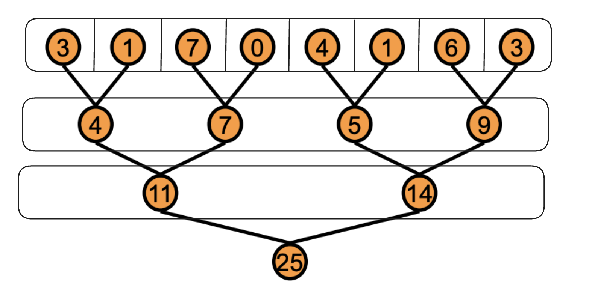
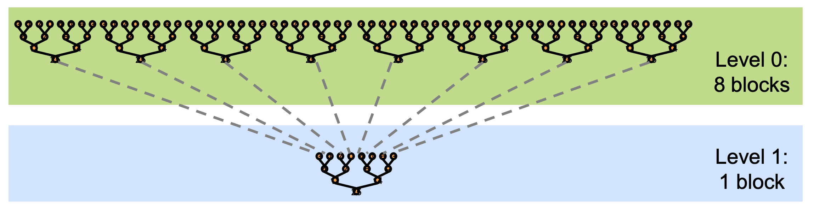
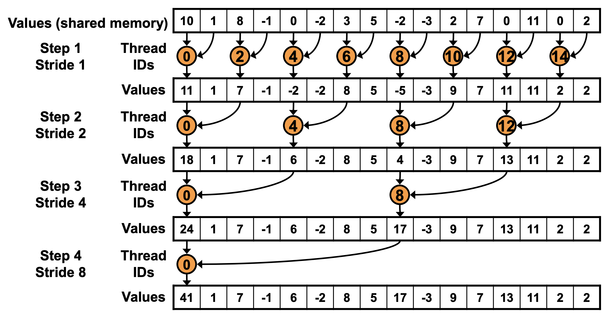
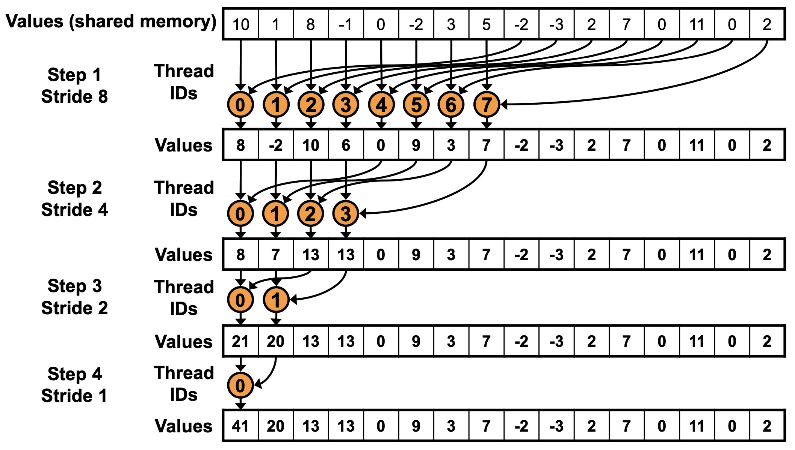

# Reduction

## Problem Definition

Given an array of $N$ elements, any operation transforming data elements into a single, summary value, is called a reduction operation. For example, `sum`, `min`, or `max` are all reduction operations. These operations are common and important data parallel primitives and deep learning. We will focus on `sum` reduction in this section but the same principles apply to other operations.

## Parallel Thinking

By nature, the problem is not organically parallelizable like matrix multiplication or vector addition. `sum` is usually think of as a sequential problem. However, **the final sum can be sum of partial sums computed in parallel**. Those partial sums again can be computed in parallel by sub-partitions of the array and so on. There is a tree-based structure to the problem that can be exploited to parallelize it.



As shown in the figure, the computation carried under sub-trees of each node are independent of each other. This means that we can compute the partial sums in parallel. 

## CUDA Implementation

Now let's think about how we can implement this in CUDA and what calculation each thread should perform. The main challenge is there is not much to do for each thread. It's more about how to organize the threads to commute with each other to compute the partial sums.

We learned that threads in the same block can be synchronized using communicate with each other using shared memory and `__syncthreads()`. Each thread can writes its partial sum to shared memory and then all threads can read from shared memory to compute the final sum. But what if the array is too large to fit in shared memory? In that case thread blocks should be synchronized and communicate partial sums to each other. **But CUDA has no global synchronization.**



The solution is to decompose the full sum into multiple kernels and launch them recursively. In the case of reductions, code for all levels is the same.

## Kernel Code



So whithin each block, we use shared memory to store the partial sums and then use `__syncthreads()` to synchronize the threads. At step 1, each thread $i$ adds its element to the element stored in shared memory by the thread at the next index $i+1$ (stride 1). At step 2, threads with even indices $i$ adds its element to the element stored in shared memory by the thread at the next index $i+2$ (stride 2). This process continues till the thread with index 0 has computed the final sum, as shown in the figure.

```cpp
__global__ void reduce(float *input, float *output) {

    // shared memory for partial sums
    extern __shared__ float sdata[];

    // each thread loads one element from global to shared mem
    int tid = threadIdx.x;
    int i = blockIdx.x * blockDim.x + threadIdx.x;
    sdata[tid] = input[i];
    __syncthreads();

    // do reduction in shared mem
    for (int s=1; s < blockDim.x; s *= 2) {
        if (tid % (2*s) == 0) {
            sdata[tid] += sdata[tid + s];
        }
        __syncthreads();
    }

    // write result for this block to global mem
    if (tid == 0) {
        output[blockIdx.x] = sdata[0];
    }
}
```

There is a problem with this code:

**Highly Divergent**

The line `if (tid % (2*s) == 0)` causes branch divergence. Remember that GPU execute threads in groups of 32 called warps. Threads within a warp execute in Single Instruction, Multiple Threads (SIMT). 

* Iteration 1 (s=1): The condition is tid % 2 == 0.
Threads 0, 2, 4, 6... are active.
Threads 1, 3, 5, 7... are inactive.
Result: Within every single warp, half the threads are active and half are inactive. Every warp suffers from divergence.
* Iteration 2 (s=2): The condition is tid % 4 == 0.
Threads 0, 4, 8... are active.
Result: Still interleaved. Most warps (until s gets very large) will contain a mix of active and inactive threads, continuing the divergence penalty.

This is problematic for following reasons:
- The hardware essentially executes the "taken" path for the active threads while the inactive threads wait.
- The inactive threads cannot do other work; their execution slots are wasted for those cycles.

The issue can be solved easily by using strided indexing as follows:

```cpp
for (unsigned int s=1; s < blockDim.x; s *= 2) {
    int index = 2 * s * tid;
    if (index < blockDim.x) {
        sdata[index] += sdata[index + s];
    }
    __syncthreads();
}
```

Now each iteration: index = 2 * s * tid.
- Thread 0 works on Index 0.
- Thread 1 works on Index 2.
- Thread 2 works on Index 4.

The active threads are now 0, 1, 2, .... They are contiguous. This means entire warps are either fully active or fully inactive (except for the boundary), effectively eliminating the divergence penalty. However, this creates bank conflicts as the memory access is strided.  Shared memory is divided into 32 banks. At Iteration 1 (s=1):
- Stride is 2 * s = 2.
- Thread 0 accesses Index 0 (Bank 0).
- Thread 16 accesses Index 32. Since there are 32 banks, Bank $32 \pmod{32} = 0$.

Thread 0 and Thread 16 try to access Bank 0 simultaneously. This creates a bank conflict.

To solve this, we need contiguous memory addressing. Here's an idea:



The idea is reversing the loop direction. Thread 0 adds `sdata[0] + sdata[256]`, Thread 1 adds `sdata[1] + sdata[257]`, and so on. This ensures that threads within a warp access contiguous memory locations, eliminating bank conflicts. This often called **sequential addressing**.

```cpp
for (unsigned int s=blockDim.x/2; s > 0; s >>= 1) {
    //s >>= 1 is the right bitwise shift assignment operator.
    // It is equivalent to divide by 2.
    if (tid < s) {
        sdata[tid] += sdata[tid + s];
    }
    __syncthreads();
}
```

As can be seen from the figure, half of the threads are idle on first loop iteration! This is wasteful! We can halve the number of the threads at launch to avoid this and instead load two elements per thread and perform the first add of the reduction.

```cpp
unsigned int tid = threadIdx.x;
// Since we halved the number of threads, multiply block index by 2*blockdim to get the actual index in global memory
unsigned int i = blockIdx.x*(blockDim.x*2) + threadIdx.x;
// adding element i and i + blockDim.x (first add of the reduction)
sdata[tid] = g_idata[i] + g_idata[i+blockDim.x];
__syncthreads();
```

The next optimization is based on the observation that as the reduction proceeds, the number of active threads decreases. When `s <= 32`, we have only one warp left doing the work. This allows us to unroll the last few iterations of the loop to avoid the overhead of the loop control instructions (comparison, update, and branch) and synchronization.

**Why Unroll?**
1.  **Instruction Overhead:** The loop overhead is significant when the body of the loop is just a single addition. Unrolling the loop removes this overhead.
2.  **Implicit Synchronization:** Threads within a warp execute in lock-step (SIMT). When the number of active threads is 32 or less (within a single warp), implicit synchronization guarantees that we don't need `__syncthreads()` *if* we are careful with memory visibility.

**Implementation:**
We can unroll the last 6 iterations (where `s=32, 16, 8, 4, 2, 1`). We also need to use the `volatile` keyword for the shared memory pointer. This limits compiler optimizations that might cache values in registers, forcing the store to shared memory to be visible to other threads in the warp immediately.

```cpp
// First, perform reduction until specifically 32 threads (one warp) are left
for (unsigned int s = blockDim.x / 2; s > 32; s >>= 1) {
    if (tid < s) {
        sdata[tid] += sdata[tid + s];
    }
    __syncthreads();
}

// Then, unroll the last warp
if (tid < 32) {
    volatile float *vsmem = sdata;
    vsmem[tid] += vsmem[tid + 32];
    vsmem[tid] += vsmem[tid + 16];
    vsmem[tid] += vsmem[tid + 8];
    vsmem[tid] += vsmem[tid + 4];
    vsmem[tid] += vsmem[tid + 2];
    vsmem[tid] += vsmem[tid + 1];
}
```

This sequence of operations performs the final summation for the block without any loops or explicit barriers, relying on warp-synchronous execution.
